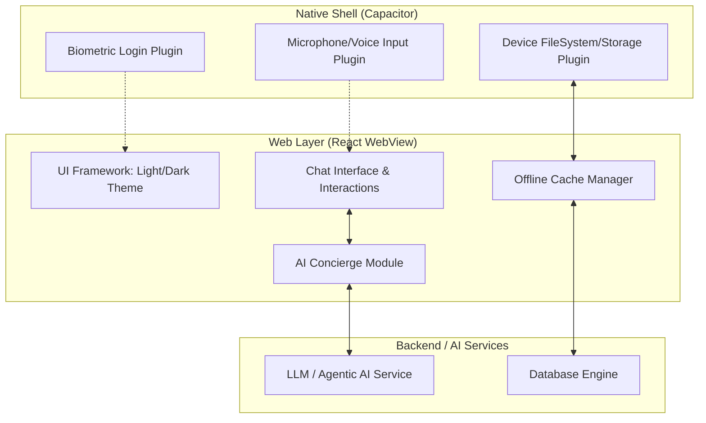
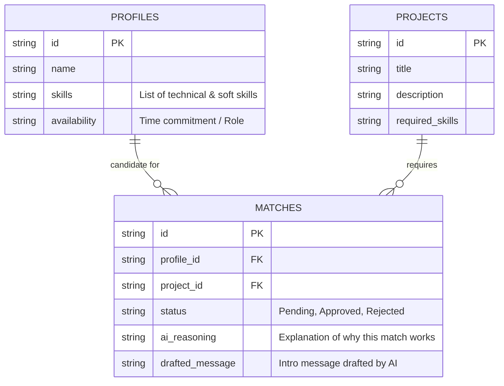
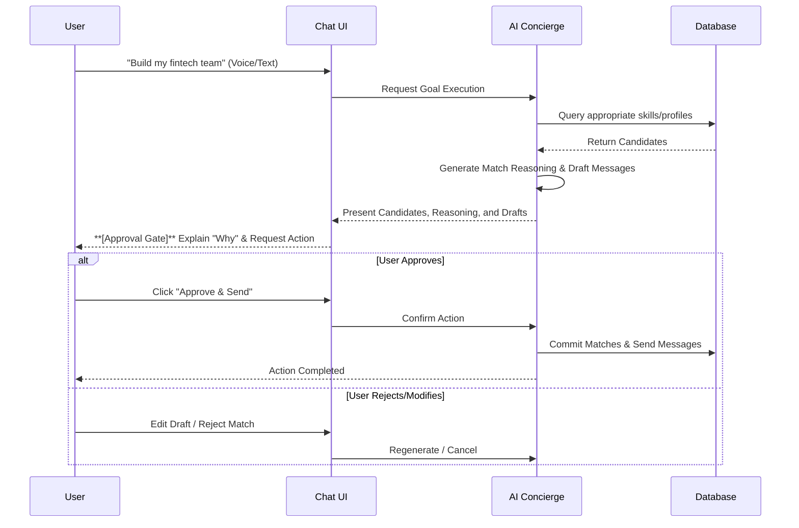

# Application & Database Architecture Diagram (Team Builder)

## 1. Application Architecture (Hybrid Mobile App)

This diagram illustrates the separation between the native device shell and the React-powered web view, showing where key features reside.

## 2. Database Schema

Tables structured to match users' skills and availability with project goals.

## 3. Agentic AI Workflow Diagram

The specific workflow flow showing the explicit human approval gate.

